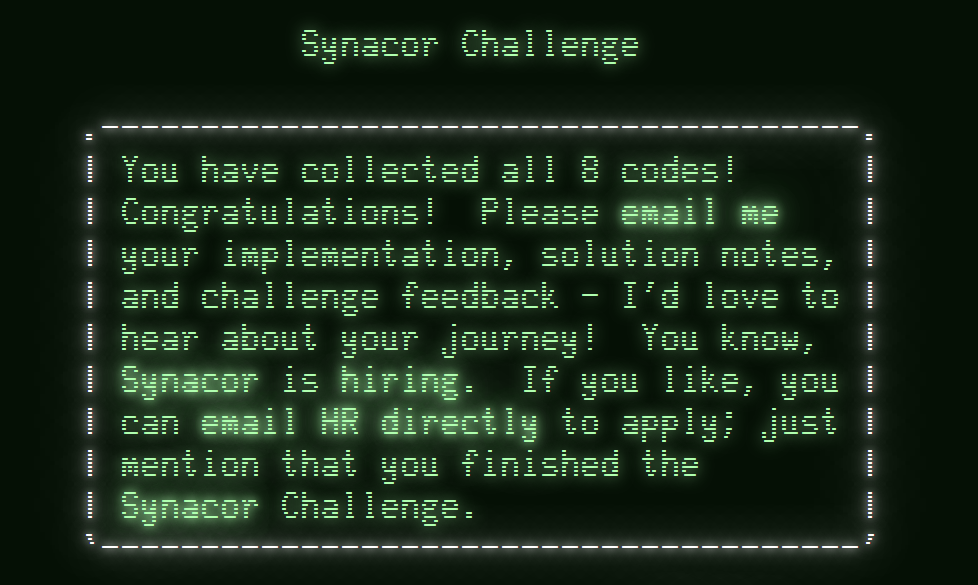

# Synacor OSCON Challenge Solution (2012)

Here you will find my walkthrough to completing the full Synacor OSCON 2012 challenge. There are a total of 8 flags (codes) to obtain in order to fully complete the challenge. The challenge will also let you know when it is fully finished in the final part.

For those interested, this was a challenge that was produced by Synacor and presented at `php[tek]` and `OSCON`. The challenge is long since 'dead' but is still online for anyone interested in playing for fun. 

You can find the challenge here: https://challenge.synacor.com/

**If you plan to try this challenge yourself; please stop reading now! This document will spoil the entire challenge!**

## Terminology

### Codes

The challenge calls the 'success' information given to you a `code`. However, to be more consistent with other CTF (capture-the-flag) style challenges and competitions, I'll be referring to them as a `flag`.

### Virtual Machine (VM)

Virtual machine refers to the emulation of another system. This challenge gives us a compiled binary file using a custom set of opcodes that we need to reimplement into our own emulation of the original system/compiler.

This will be referred to as a `VM` mainly.

See more here: https://en.wikipedia.org/wiki/Virtual_machine

### Opcode

Opcodes, or operation codes, are what tell the virtual machine how to function. This challenge outlines the available and expected opcodes that should be implemented within the `arch-spec` documentation. 

See more here: https://en.wikipedia.org/wiki/Opcode

## Challenge Information

When you sign up for the challenge, you will be given an archive containing two files:

  - `arch-spec`
  - `challenge.bin`

First, `arch-spec` contains the information about the challenge. This outlines that the challenge will involve a virtual machine, which we need to implement, and gives us information on how the VM should operate. 

Next, `challenge.bin` is the binary file that is intended to be ran within the virtual machine we need to implement. _Note: The `challenge.bin` file is unique to each player of the challenge. My flags will not work for you. However, the challenge is still the same otherwise, so the steps to get the flags will be the same._

I will be breaking up my solution into 'phases' as I progressed through the challenge. _This solution is written after the fact of completing the challenge, and based on notes I wrote down as I went through it. So the prespective of this writing is after the fact._

## Phase 1 - RTFM - `Flag #1`

The challenge begins with the package we are given upon signing up. Reading the `arch-spec` file will present us with the information about the challenge, the virtual machine implementation information, and also contains the first flag.

**Flag 1:** `fNCoeXxLEawt`

_**Note:** It is possible to see the next flag in the `challenge.bin` file as well. But, we'll save that for the next phase instead._

## Phase 2 - Building The Virtual Machine - `Flag #2 and #3`

_The virtual machine can be found in: [vm.py](vm.py)_

The next step of the challenge is to begin building the virtual machine. The `arch-spec` documentation gives a full description of how that should be accomplished. The key takeaway points from that are:

**Architecture**

  - 3 regions of storage
    - `Memory` - 15-bit address space, storing 16-bit values.
    - `Registers` - 8 16-bit register values.
    - `Stack` - Unbounded stack, storing 16-bit values.
  - All numbers are treated as unsigned 15-bit values. (0 to 32767)
  - All math operations are modulo 32768. (ie. `32758 + 15 = 5`)

**Binary Format**

  - **Numbers**
    - Each number is stored as a 16-bit little-endian pair.
    - Numbers `0 to 32767` are literal.
    - Numbers `32768 to 32775` are register index values. (ie. `32768 = index 0, 32769 = index 1, etc.`)
    - Numbers `32776` and higher are considered invalid.
  - **Program**
    - Programs are loaded into memory, starting at execution address: `0`

For this, I choose to code my tools in `Python`. _(Note: I am a beginner with Python so I am sure there are tons of better ways to do things that what I opt'd for.)_

I started with beginning to implement the virtual machine with the basic information provided above. I know that there is a block of memory holding the loaded data from `challenge.bin`, a set of 8 registers, and an unbound stack, so my implementation started with:

```py
class VirtualMachine():
    reg = [0, 0, 0, 0, 0, 0, 0, 0]
    stk = []
    pos = 0
    mem = []
```

From there, I know that we need to load `challenge.bin` into `data` as `uint16_t` chunks.

That is as simple as:

```py
    def load(self, path):
        if not os.path.exists(path):
            return False

        s = os.path.getsize(path)

        with open(path, 'rb') as f:
            for _ in range(int(s / 2)):
                self.mem.append(struct.unpack('H', f.read(2))[0])
```

With the basic loading setup, I needed to have a way to handle opcode lookups. A friend had recently shown me how to make use of decorators in Python for a similar project, so I opt'd to make use of that here as well.

I made a basic `opcode` decorator that would mark a function as a handler for the VM and then dynamically build the list of opcodes for the VM based on all found functions with the attribute.

```py
def opcode(o, a, n):
    def decorator(self):
        self.opcode = o
        self.args = a
        self.name = n
        return self
    return decorator
```

Then updating the `VirtualMachine.__init__` method:

```py
    def __init__(self):
        for f in [getattr(self, k) for k in dir(self)]:
            if hasattr(f, '__func__') and hasattr(f.__func__, 'opcode'):
                self.ops[getattr(f.__func__, 'opcode')] = (getattr(f.__func__, 'name'), getattr(f.__func__, 'args'), f)
```

Now I can implement opcodes as needed and easily register them to the VM without needing to do any extra work or code changes. Simply add the `opcode` decorator to the function and the rest is handled.

Next up, I needed to implement the means to tell the VM to run. This would just be a simple loop until `pos` reached the end of the `data`. _(And other conditions to follow as the VM matures and each opcode is implemented.)_

To start that out, I had:

```py
    def run(self):
        while not self.pos < len(self.data):
            opcode = self.data[self.pos]

            try:
                _, args, func = self.ops[opcode]

                if not func():
                    self.pos += args + 1

            except BaseException as f:
                print('[!] Caught exception while executing virtual machine:')
                raise f
```

This way now, attempting to run the virtual machine would trigger exceptions on each unknown/unhandled opcode. This would also allow me to ensure that each opcode was working as intended. For example, trying to run the virtual machine in its current state now will yield:

```
  File "vm.py", line 196, in run
    _, args, func = self.ops[opcode]
KeyError: 21
```

So now we can start implementing the actual opcodes as they are used by the VM. 

To start, the VM will try and use `0x15` and `0x13` first. Once these two opcodes are implemented, then you will be greeted with the next flag.

**Flag 2:** `oeodrhmQevxr`

Continuing further, the VM will then make use of the following opcodes in the given order:

`0x06` > `0x07` > `0x08` > `0x01` > `0x09` > `0x04` > `0x02` > `0x03` > `0x05` > `0x0C` > `0x0D` > `0x0E` > `0x11` > `0x0A` > `0x0B` > `0x0F` > `0x10` > `0x12`

At this point, we'll see the VM complete its self-test stage and print out the next flag.

**Flag 3:** `julwziJYvqxM`

The VM will also die due to missing opcode `0x14` and we'll also see our first non-VM self-test related messages:

```
== Foothills ==
You find yourself standing at the base of an enormous mountain.  At its base to the north, there is a massive doorway.  A sign nearby reads "Keep out!  Definitely no treasure within!"

Things of interest here:
- tablet

There are 2 exits:
- doorway
- south
```

Is this an old school dungeon crawler!? _My nostolga bells are ringing!_ This was a surprise to see as I wasn't expecting something like this. I used to play old school text based crawlers, both single player as well as online on various MUD's/MOO's etc. _(Shout-out to the original `PokeMUD` before the owners handed off to an idiot that destroyed it.)_

Last up was opcode `0x14` and opcode `0x00` to finish implementing all of them.

`0x00` is simple and is just a halt code to terminate the VM. 

`0x14` on the other hand was a bit tricky to figure out at first. I wasn't sure how to deal with single character input in Python, and most sites online say its not directly possible unless you import `msvcrt` and use `getch()`. 

This is when I decided to write a disassembler as well to help show me how the VM was handling input.

## Phase 3 - Building The Disassembler; Finding Input Processing

_The disassembler can be found in: [dism.py](dism.py)_

Writing the disassembler was fairly straight forward and basically just a copy of the VM, but instead of processing any of the code and following jumps/calls/etc. we are just directly processing every block inside of the loaded data as-is. This means we have no state-based information to work with.

I copied over my `VirtualMachine` class, renamed it to `Disassembler` and gutted the opcode handlers. Instead, this time I changed how the `run` call works to instead dump out information about each opcode.

The main `run` call was responsible for building the basic output information while each handler was responsible for building a pseudo comment that is displayed for the opcode. This comment could be a basic reprint of the name for opcodes that did nothing major, or could be constructed to output a small statement of code showing what the opcode is doing.

For the `run` part, the output would start and look like this:

```
01E1 | 13 00 0A 00              | out   |
01E3 | 00 00                    | halt  |
01E4 | 07 00 00 00 32 04        | jt    |
01E7 | 08 00 01 00 32 04        | jf    |
01EA | 07 00 01 00 EF 01        | jt    |
01ED | 06 00 32 04              | jmp   |
```

Next, with the per-opcode commenting implemented, we get output like this:

```
01E1 | 13 00 0A 00              | out   | \n
01E3 | 00 00                    | halt  | hault
01E4 | 07 00 00 00 32 04        | jt    | jnz 0432 : (0000 != 0)
01E7 | 08 00 01 00 32 04        | jf    | jz 0432 : (0001 == 0)
01EA | 07 00 01 00 EF 01        | jt    | jnz 01EF : (0001 != 0)
01ED | 06 00 32 04              | jmp   | jmp 0432
```

_I took the liberty of renaming some of the information in the pseudo comments, such as `jt` being shown as `jnz` instead. I'm more familiar with x86/x64 assembly so at a quick glance its easier to read than `jt`._

To further expand the usefulness of the disassembler, I also looked at how the initial dump looked and saw a consistent pattern of how function blocks were treated. For this, I opt'd to add a linebreak after each `halt`, `jmp`, and `ret` to allow even easier understanding of 'blocks' in the code.

With this, I could now easily see any part of the code I wanted and quickly understand what it was doing.

Now we can see how input is being processed. For that we can dump the `challenge.bin` and look for opcode `0x14` being used, which is found here:

```
06E7 | 02 00 00 80              | push  | push reg[0]
06E9 | 02 00 02 80              | push  | push reg[2]
06EB | 02 00 03 80              | push  | push reg[3]
06ED | 02 00 04 80              | push  | push reg[4]
06EF | 02 00 05 80              | push  | push reg[5]
06F1 | 09 00 02 80 01 80 00 80  | add   | reg[2] = (reg[1] + reg[0]) % 32768
06F5 | 01 00 00 80 01 80        | set   | reg[0] = reg[1]
06F8 | 01 00 05 80 00 00        | set   | reg[5] = 0000
06FB | 09 00 00 80 00 80 01 00  | add   | reg[0] = (reg[0] + 0001) % 32768
06FF | 05 00 03 80 00 80 02 80  | gt    | reg[3] = reg[0] > reg[2]
0703 | 07 00 03 80 18 07        | jt    | jnz 0718 : (reg[3] != 0)
0706 | 14 00 04 80              | in    | reg[4] = (user input)
0708 | 04 00 03 80 04 80 0A 00  | eq    | reg[3] = reg[4] == 000A
070C | 07 00 03 80 18 07        | jt    | jnz 0718 : (reg[3] != 0)
070F | 10 00 00 80 04 80        | wmem  | data[reg[0]] = reg[4]
0712 | 09 00 05 80 05 80 01 00  | add   | reg[5] = (reg[5] + 0001) % 32768
0716 | 06 00 FB 06              | jmp   | jmp 06FB

0718 | 10 00 01 80 05 80        | wmem  | data[reg[1]] = reg[5]
071B | 04 00 03 80 04 80 0A 00  | eq    | reg[3] = reg[4] == 000A
071F | 07 00 03 80 26 07        | jt    | jnz 0726 : (reg[3] != 0)
0722 | 14 00 04 80              | in    | reg[4] = (user input)
0724 | 06 00 1B 07              | jmp   | jmp 071B

0726 | 03 00 05 80              | pop   | reg[5] = stack.pop()
0728 | 03 00 04 80              | pop   | reg[4] = stack.pop()
072A | 03 00 03 80              | pop   | reg[3] = stack.pop()
072C | 03 00 02 80              | pop   | reg[2] = stack.pop()
072E | 03 00 00 80              | pop   | reg[0] = stack.pop()
0730 | 12 00                    | ret   | ret
```

From here, we can see how input is being read. The jist of this is essentially the following:

  * Preserve the current register states.
  * Prepare the needed registers for use.
  * Prepare the input buffer for use.
  * Ensure the buffer length is valid.
  * Wait for user input.
  * Test if input is a new line character. (0x000A)
    * If new line found, write a null char after the buffer, exit out.
    * If new line is not found, step the buffer index, wait for input and repeat.

Now that we understand this, we can implement how input should be handled. We know that the input handler will keep being called on each individual character until the input given is a new line character (0x000A). Python offers a means to read input as a single character and buffer the rest via `sys.stdin.read(1)` which we can use like this:

```py
    @opcode(0x14, 1, 'in')
    def op_in(self):
        a = self.data[self.pos + 1]

        if not self.is_reg(a):
            raise Exception('Invalid register index.')

        self.reg[a - 32768] = ord(sys.stdin.read(1))
```

If you are new to old school dungeon crawlers, they generally have a basic set of commands to do everything. Movement is usually done by saying the name of an available exit/direction, or prefixing it with a word such as `go`, `move`, `travel`, or similar. Each room will generally print its lore/description and contents as you enter, but you can generally also do `look` or `see` to reprint that. Items are usually picked up, used or looked at using commands such as `get` or `take`, `use`, and `look` is usually reused for items based on the given sub-item/command.

When lost, there is also generally always a `help` command. So lets start with that:

```
look
  You may merely 'look' to examine the room, or you may 'look <subject>' (such as 'look chair') to examine something specific.
go
  You may 'go <exit>' to travel in that direction (such as 'go west'), or you may merely '<exit>' (such as 'west').
inv
  To see the contents of your inventory, merely 'inv'.
take
  You may 'take <item>' (such as 'take large rock').
drop
  To drop something in your inventory, you may 'drop <item>'.
use
  You may activate or otherwise apply an item with 'use <item>'.
```

What I figured, great! :) Let's get started!

## Phase 4 - Dungeon Crawler Flashbacks - `Flag #4`

As I mentioned before, I was really big into dungeon crawlers when I was younger. They were one of the first ways to play online games with others and honestly were some of my favorite times spent playing games. The amount of creativity people came up with on a game with no graphics was always so fun to experience.

When we first start the VM now with all opcodes implemented, we are greated with the first room:

```
== Foothills ==
You find yourself standing at the base of an enormous mountain.  At its base to the north, there is a massive doorway.  A sign nearby reads "Keep out!  Definitely no treasure within!"

Things of interest here:
- tablet

There are 2 exits:
- doorway
- south

What do you do?
```

The first thing we notice is that there is an item here on the ground. With any crawler style game it is generally wise to pickup everything you find and look at it or try to use it. It's how most interactions in these kinds of games work. _(I'd suggest looking first before use, as some items may be traps etc.)_

So we can start with:

```
take tablet
look tablet
```

Which gives us:

```
The tablet seems appropriate for use as a writing surface but is unfortunately blank.  Perhaps you should USE it as a writing surface...
```

Odd.. you'd figure it would be something to read and not use.. so lets use it:

```
use tablet
```

Which gives us our next flag:

```
You find yourself writing "BYuiRHbigojB" on the tablet.  Perhaps it's some kind of code?
```

**Flag 4:** `BYuiRHbigojB`

## Phase 5 - Into The _Twisted_ Maze - `Flag #5`

My next steps were to just explore for a bit. I wanted to do some testing with the VM to ensure it was proper and stable as well as to get my bearings with the game. These kinds of games can have all kinds of things in them, so it's best to first play around a bit before diving into the code, hacking, etc.

Firstly, I also wanted to see if the game was static or randomly generating the map. I wrote down my first set of around 15 moves between the first areas of the game and kept restarting the VM. Each time, I could reproduce the same path without issue, so at least for now, nothing seemed random.

While randomly going around the map I did eventually stumble on a few key rooms. 

### Twisty Passages (`Can` Item)

The first room was a room with a `can` item and the next flag.

**Flag 5:** `MZktqpCbmHcT`

_Looking at the can tells us it is used with a lantern. This lets us know there is another item we need to find._

### Darkness

During the random traveling through the twisted maze, the is a room that has an exit called `darness`. Entering this area will give you a hint that you need to find a light source. If you keep going further into this area without a light, you will get lost and eventually die to a `Grue` creature.

So now we have two hints towards finding a light, in this case a lantern.

### Lantern (`empty lantern` Item)

The other room contained an `empty lantern` item. 

At this point, I now had the `can` and `empty lantern` and knew that the `darkness` area hinted I needed to enter it with a light, so I needed to head back there.

Since I was only messing about at this stage, I hadn't really traced my steps well. This is when I started to add custom commands to my VM allowing me to do a few different things.

## Phase 6 - Custom Virtual Machine Commands

To assist with the challenge at this point, it was pretty clear I was going to need to either start writing down every command I did, or I would need to make a way to see a history of sorts. For this, I opt'd to go with adding custom commands to the VM.

Since we already have an input opcode, we can just record the input into our own buffer and manually handle anything we want when we see an enter press. I opt'd to prefix my commands with `!` to ensure they don't interfere with the normal commands of the game. _This is meant to be a basic command handling, not anything extreme, so we don't handle special cases like quotes and other junk._

The VM includes the following custom commands at this point:

  - `!help` - _Prints the available custom commands._
  - `!history` - _Saves the past command history to \'commands.txt\' on disk._
  - `!halt` - _Sets the halt flag, killing the VM._
  - `!kill` - _Sets the halt flag, killing the VM._
  - `!dump` - _Dumps the current VM memory to \'dump.bin\' on disk._
  - `!pos` - _Prints the current execution position of the VM._
  - `!getreg` - _Prints the current register values._
  - `!getstack` - _Prints the current stack values._
  - `!setreg <index> <value..>` - _Sets a register value._
  - `!poke <index> <value..>` - _Writes value(s) to memory._
  - `!peek <index> <count=1>` - _Reads value(s) from memory._

_All commands that take a number parameter interpret the number as a hexadecimal number for ease of use with info taken from the disassembler and other command output!._

Now we have some helpful features in the VM to assist with various aspects of the challenge. For now, the important one here to help start really mapping out the dungeon and rooms is `!history` which let me review my movements and then compare between different runs. With this, I could narrow down the movements needed to get to the various important rooms of the challenge and move onto the next phase.

## Phase 7 - The Ruins - `Puzzle, Flag #6`

With the `lantern` now lit, we can safely continue through the darkness. Going through this area will lead us to the `Ruins`. As you enter the first room, you will find a `red coin` item. Then following into the next room we are greeted with the first main puzzle. 

```
== Ruins ==
You stand in the massive central hall of these ruins.  
The walls are crumbling, and vegetation has clearly taken over.  
Rooms are attached in all directions.  
There is a strange monument in the center of the hall with circular slots and unusual symbols.  
It reads:

_ + _ * _^2 + _^3 - _ = 399
```

Here we are given a math problem with missing values. If you look at the red coin, you will also get a hint that the coin has a value that goes into the solution of the puzzle. This hints us towards there being other items to find that will help with this puzzle. From here, I wondered the `Ruins` to look for more items and eventually found several other coins. Each coin has its own description with a different hint/number:

  - `red coin`: _This coin is made of a red metal.  It has two dots on one side._
  - `corroded coin`: _This coin is somewhat corroded.  It has a triangle on one side._
  - `shiny coin`: _This coin is somehow still quite shiny.  It has a pentagon on one side._
  - `concave coin`: _This coin is slightly rounded, almost like a tiny bowl.  It has seven dots on one side._
  - `blue coin`: _This coin is made of a blue metal.  It has nine dots on one side._

The descriptions are hints to the numbers they represent for the math puzzle:

  - `red coin`: 2
  - `corroded coin`: 3
  - `shiny coin`: 5
  - `concave coin`: 7
  - `blue coin`: 9

Now the goal is to just plug in the numbers into each slot until the problem is solved. This can be done by brute-forcing since there is only 5 numbers total, so the time required to randomly get the answer is fairly low.

My solver for this can be found in: [ruins.py](ruins.py)

Once the brute-forcer completes, it will print out the order in which the coins fit the math problem. This is the same order you need to use the coins in the main room of the `Ruins` where the monument is.

Upon using the coins in the correct order, you will be greeted with the message:

```
As you place the last coin, you hear a click from the north door.
```

Otherwise, the coins will fall to the floor and you will have to try again.

Once the door is open, we can go north and find a `teleporter` item. Taking and using the teleporter will greet us with our next flag.

**Flag 6:** `OZChctsXArCX`

## Phase 8 - The End..? Teleporter - `Puzzle`

After using the teleporter, we find ourselves in a new area `== Synacor Headquarters ==` which only has two rooms. There doesn't seem to be any way to exit this area. Have we reached the end of the game already..? This can't be the end as we still have several flags to go. There are two items here though, one of which is a huge hint towards what we need to do next.

  - `business card`
  - `strange book`

The `business card` appears to be a dead item with no use. It just advertises the site the challenge is from, and makes sense for the area since we are in the `Synacor Headquaters`. 

The `strange book` on the other hand, holds the information and clues needed on what to do next.

```
The cover of this book subtly swirls with colors.  It is titled "A Brief Introduction to Interdimensional Physics".  It reads:

Recent advances in interdimensional physics have produced fascinating
predictions about the fundamentals of our universe!  For example,
interdimensional physics seems to predict that the universe is, at its root, a
purely mathematical construct, and that all events are caused by the
interactions between eight pockets of energy called "registers".
Furthermore, it seems that while the lower registers primarily control mundane
things like sound and light, the highest register (the so-called "eighth
register") is used to control interdimensional events such as teleportation.

A hypothetical such teleportation device would need to have have exactly two
destinations.  One destination would be used when the eighth register is at its
minimum energy level - this would be the default operation assuming the user
has no way to control the eighth register.  In this situation, the teleporter
should send the user to a preconfigured safe location as a default.

The second destination, however, is predicted to require a very specific
energy level in the eighth register.  The teleporter must take great care to
confirm that this energy level is exactly correct before teleporting its user!
If it is even slightly off, the user would (probably) arrive at the correct
location, but would briefly experience anomalies in the fabric of reality
itself - this is, of course, not recommended.  Any teleporter would need to test
the energy level in the eighth register and abort teleportation if it is not
exactly correct.

This required precision implies that the confirmation mechanism would be very
computationally expensive.  While this would likely not be an issue for large-
scale teleporters, a hypothetical hand-held teleporter would take billions of
years to compute the result and confirm that the eighth register is correct.

If you find yourself trapped in an alternate dimension with nothing but a
hand-held teleporter, you will need to extract the confirmation algorithm,
reimplement it on more powerful hardware, and optimize it.  This should, at the
very least, allow you to determine the value of the eighth register which would
have been accepted by the teleporter's confirmation mechanism.

Then, set the eighth register to this value, activate the teleporter, and
bypass the confirmation mechanism.  If the eighth register is set correctly, no
anomalies should be experienced, but beware - if it is set incorrectly, the
now-bypassed confirmation mechanism will not protect you!

Of course, since teleportation is impossible, this is all totally ridiculous.
```

This tells us how the teleporter works. It also reveals several secrets/hints about the teleporter _(and how the virtual machine interacts with it)_ which tells us what we should be doing to progress further. A quick rundown of the important parts of the book are:

  - The lower VM `Register` values are used for mundane tasks.
  - The highest VM `Register` value (8) is used for teleportation.
  - Teleporter needs to have two destinations.
    - First destination would be used when the eighth register is at its minimum energy level. (Default)
    - Second destination would be used when the eighth register is at a specific energery level.
      - If not correct, you may land up in the proper location, but with weird problems.

From this, we can gather that we currently teleported to the default location. We can also check the state of the game right now after teleporting _(and before)_ and see what the highest register is set to using the `!getreg` command I made:

  - Before using the teleporter: `reg[7] == 0`
  - After using the teleporter: `reg[7] == 0`

Ok, so we know the teleporter is set to 0 when going to the default location. Let's try and alter the register and use the teleporter again. We can do that with my `!setreg` command:

*Commands:*
```
!setreg 7 1
use teleporter
```

Doing this gives us the following message instead when using the teleporter:

```
A strange, electronic voice is projected into your mind:

  "Unusual setting detected!  Starting confirmation process!  Estimated time to completion: 1 billion years."
```

The virtual machine is also deadlocked in a loop. Ok, perhaps it's just not 1? I tried with several other values, all of which end us up with this message. So the value is apparently a specific number, we need to dig into how the game is processing this instead. 

Using the disassembler I wrote, we can easily find where the teleporter code is being handled by looking for usages of the highest register. In my setup, that is `reg[7]`. _(8 registers, 0 being the first index.)_ So we can just look for usages of `reg[7]` which there are only a few:

```
; Self Check

0209 | 07 00 07 80 45 04        | jt    | jnz 0445 : (reg[7] != 0)

; Unknown

154B | 08 00 07 80 E5 15        | jf    | jz 15E5 : (reg[7] == 0)

; Unknown

1592 | 01 00 00 80 07 80        | set   | reg[0] = reg[7]

; Unknown

179A | 01 00 01 80 07 80        | set   | reg[1] = reg[7]
```

The first is part of the games initial self-check. It ensures all registers are set to 0 when the VM is started. _This is both a means to test the VM is working correctly, but also a means to prevent 'cheating' by setting the registers to specific values on load._ The second is what we're after and is the check for when the teleporter is used. That looks like this:

```
1545 | 02 00 00 80              | push  | push reg[0]
1547 | 02 00 01 80              | push  | push reg[1]
1549 | 02 00 02 80              | push  | push reg[2]
154B | 08 00 07 80 E5 15        | jf    | jz 15E5 : (reg[7] == 0)
154E | 02 00 00 80              | push  | push reg[0]
1550 | 02 00 01 80              | push  | push reg[1]
1552 | 02 00 02 80              | push  | push reg[2]
1554 | 01 00 00 80 AC 70        | set   | reg[0] = 70AC
1557 | 01 00 01 80 FB 05        | set   | reg[1] = 05FB
155A | 09 00 02 80 4C 23 33 39  | add   | reg[2] = (234C + 3933) % 32768
155E | 11 00 B2 05              | call  | call 05B2
1560 | 03 00 02 80              | pop   | reg[2] = stack.pop()
1562 | 03 00 01 80              | pop   | reg[1] = stack.pop()
1564 | 03 00 00 80              | pop   | reg[0] = stack.pop()
1566 | 15 00                    | noop  | noop
1567 | 15 00                    | noop  | noop
1568 | 15 00                    | noop  | noop
1569 | 15 00                    | noop  | noop
156A | 15 00                    | noop  | noop
156B | 01 00 00 80 04 00        | set   | reg[0] = 0004
156E | 01 00 01 80 01 00        | set   | reg[1] = 0001
1571 | 11 00 8B 17              | call  | call 178B
1573 | 04 00 01 80 00 80 06 00  | eq    | reg[1] = reg[0] == 0006
1577 | 08 00 01 80 CB 15        | jf    | jz 15CB : (reg[1] == 0)
157A | 02 00 00 80              | push  | push reg[0]
157C | 02 00 01 80              | push  | push reg[1]
157E | 02 00 02 80              | push  | push reg[2]
1580 | 01 00 00 80 56 71        | set   | reg[0] = 7156
1583 | 01 00 01 80 FB 05        | set   | reg[1] = 05FB
1586 | 09 00 02 80 BE 17 2B 24  | add   | reg[2] = (17BE + 242B) % 32768
158A | 11 00 B2 05              | call  | call 05B2
158C | 03 00 02 80              | pop   | reg[2] = stack.pop()
158E | 03 00 01 80              | pop   | reg[1] = stack.pop()
1590 | 03 00 00 80              | pop   | reg[0] = stack.pop()
1592 | 01 00 00 80 07 80        | set   | reg[0] = reg[7]
1595 | 01 00 01 80 0A 65        | set   | reg[1] = 650A
1598 | 01 00 02 80 FF 7F        | set   | reg[2] = 7FFF
159B | 02 00 03 80              | push  | push reg[3]
159D | 01 00 03 80 39 72        | set   | reg[3] = 7239
15A0 | 11 00 31 07              | call  | call 0731
15A2 | 03 00 03 80              | pop   | reg[3] = stack.pop()
15A4 | 02 00 00 80              | push  | push reg[0]
15A6 | 02 00 01 80              | push  | push reg[1]
15A8 | 02 00 02 80              | push  | push reg[2]
15AA | 01 00 00 80 3D 72        | set   | reg[0] = 723D
15AD | 01 00 01 80 FB 05        | set   | reg[1] = 05FB
15B0 | 09 00 02 80 DC 5E 1C 1C  | add   | reg[2] = (5EDC + 1C1C) % 32768
15B4 | 11 00 B2 05              | call  | call 05B2
15B6 | 03 00 02 80              | pop   | reg[2] = stack.pop()
15B8 | 03 00 01 80              | pop   | reg[1] = stack.pop()
15BA | 03 00 00 80              | pop   | reg[0] = stack.pop()
15BC | 10 00 AC 0A C2 09        | wmem  | data[0AAC] = 09C2
15BF | 10 00 AD 0A 00 00        | wmem  | data[0AAD] = 0000
15C2 | 09 00 01 80 94 0A 02 00  | add   | reg[1] = (0A94 + 0002) % 32768
15C6 | 10 00 01 80 FF 7F        | wmem  | data[reg[1]] = 7FFF
15C9 | 06 00 52 16              | jmp   | jmp 1652
```

Here we can see the game is checking if the `reg[7]` value is 0. If it is, then it jumps ahead to `15E5`. However, if it is not 0, then it instead moves ahead with doing another call and setup. The first call is to `05B2`. _This isn't important to this and is actually the handler for loading and printing an encrypted string._

The next call, however, is important:

```
156B | 01 00 00 80 04 00        | set   | reg[0] = 0004
156E | 01 00 01 80 01 00        | set   | reg[1] = 0001
1571 | 11 00 8B 17              | call  | call 178B
1573 | 04 00 01 80 00 80 06 00  | eq    | reg[1] = reg[0] == 0006
1577 | 08 00 01 80 CB 15        | jf    | jz 15CB : (reg[1] == 0)
```

This is setting up a function call to `178B` which can be seen here:

```
178B | 07 00 00 80 93 17        | jt    | jnz 1793 : (reg[0] != 0)
178E | 09 00 00 80 01 80 01 00  | add   | reg[0] = (reg[1] + 0001) % 32768
1792 | 12 00                    | ret   | ret

1793 | 07 00 01 80 A0 17        | jt    | jnz 17A0 : (reg[1] != 0)
1796 | 09 00 00 80 00 80 FF 7F  | add   | reg[0] = (reg[0] + 7FFF) % 32768
179A | 01 00 01 80 07 80        | set   | reg[1] = reg[7]
179D | 11 00 8B 17              | call  | call 178B
179F | 12 00                    | ret   | ret

17A0 | 02 00 00 80              | push  | push reg[0]
17A2 | 09 00 01 80 01 80 FF 7F  | add   | reg[1] = (reg[1] + 7FFF) % 32768
17A6 | 11 00 8B 17              | call  | call 178B
17A8 | 01 00 01 80 00 80        | set   | reg[1] = reg[0]
17AB | 03 00 00 80              | pop   | reg[0] = stack.pop()
17AD | 09 00 00 80 00 80 FF 7F  | add   | reg[0] = (reg[0] + 7FFF) % 32768
17B1 | 11 00 8B 17              | call  | call 178B
17B3 | 12 00                    | ret   | ret
```

Looking this over, we can easily come to the conclusion that this is a recursion function of sorts. It has three parts that are all leading to self-calls unless a certain condition is met. We can instead rewrite the pseudo disassembler code into pseudo Python and get:

```py
r0 = 4 # Loaded from: 156B opcode
r1 = 1 # Loaded from: 156E opcode
r7 = 0 # Loaded from: reg[7] value

def func_178B():
    # Implements 178B
    if r0 == 0:
        r0 = (r1 + 1) % 32768
        return

    # Implements 1793
    if r1 == 0:
        r0 = (r0 + 0x7FFF) % 32768
        r1 = r7
        func_178B()
        return

    # Implements 17A0
    self.stk.push(r0)
    r1 = (r1 + 0x7FFF) % 32768
    func_178B()
    r1 = r0
    r0 = self.stk.pop()
    r0 = (r0 + 0x7FFF) % 32768
    func_178B()
    return
```

Taking the pseudo Python code and translating that into real workable code, since we know the arguments and setup for the calls, yields us with an immediate stack overflow, hitting Pythons stack limit of 997 entries. This is some pretty heavy / deep recursion going on. Going to Google for some basic searching will yield us the actual name of this kind of function and what its based off of. It is known as an `Ackermann` function, slightly modified though. You can find more information regarding Ackermann's function here:

https://en.wikipedia.org/wiki/Ackermann_function

Looking at this article, and several other sites that reference it (ie. StackOverflow, some personal blogs, some math papers and such) we can see how the game has modified the function compared to the original. 

Firstly, the common `Ackermann` function implementation takes 2 arguments, however the game is making use of 3. _(`Ackermann` originally submitted his theory and function as a 3 argument function.)_ The third argument is being used in the following manner compared to the original:

```cpp
/*
 * By default, Ackermann states that:
 * 
 *                  | n + 1                     when m == 0
 *      A(m, n) =   | A(m -1, 1)                when m > 0, n == 0
 *                  | A(m -1, A(m, n - 1)       when m > 0, n > 0
 * 
 * However, with the Synacor variant, the third parameter is introduced and replaces the default
 * usage of 1 in such cases as the second above.
 * 
 *                  | n + 1                     when m == 0
 *   A(m, n, p) =   | A(m - 1, p)               when m > 0, n == 0
 *                  | A(m - 1, A(m, n - 1)      when m > 0, n > 0
 * 
 */
```

Alright, so we know what the function is, and what it does. We also know how the game implementation has modified it. So we can now reimplement it in a manner that is more optimized and can hopefully run in Python, right?

Yea no.. I tried for a while to code a working variant of this in Python that wasn't ungodly slow, but Python is just not cutting it for me. _(Again, I am a noob with Python so there may be a way to get this going and be fast, but I couldn't figure it out..)_ 

I tried a number of different ways to speed this up as well as avoid the stack issues. Here's a few things I tried:

### Memoization

The first thought was to try and make use of memoization on the function. This is a common technique to deal with recursion calls that can have common result cases. _The `Ackermann` function is a great candidate for this due to how it works._ Sadly, this didn't work well enough by itself to speed things up enough.

I tried several ways of memoization as well.

  - Personal custom implementation using a two-dimensional array dictionary.
  - Personal custom implementation using a one-dimensional array dictionary.
  - Library: `python-memoization`
  - Library: `functools` making use of `@cache` and `lru_cache`
  - Others implementations of `Ackermann` functions with memoization. _(I'd modify them for the changes needed.)_

### Python JIT'ing via pyjion

I was recommended a JIT library `pyjion` from a friend. Sadly, it appears it does not properly support the full `sys` library and ignores any attempts to change the stack sizes and recusion limits. I didn't dig into other implementations of JIT'ing though as those all require using a different interpreter engine altogether. I didn't want to require the need of additional things like custom Python engines, so I chose to abandon this route after `pyjion` failed.

### Threading / Multi-Processing

To deal with the stack limitations in Python, I tried and spawned my worker function in a new thread with the recursion and stack limits changed. Python allows you to change the recursion limit, but it does not allow you to change the stack size of the main thread. Instead, you have to spawn a new thread with modified stack sizes. For that we can do:

```py
# Set the recursion limit to much higher..
sys.setrecursionlimit(10 ** 8)

# Adjust the threading stack size..
threading.stack_size(0x8000000)
```

This will allow our code to run, but monitoring the iterations shows it's still way too slow. I next tried to split the work into multiple threads thinking Python would have a better time dealing with a split workload. I setup a worker pool that splits the key attempts up into chunks (0 to 32768 total, divided by `n` threads.) and tried again. Python was still stuck only using 12% CPU, what gives..? Apparently, threading in Python is not really true multithreading because of how the state lock is handled. _(Known as the GIL, or Global Interpreter Lock.)_

Next, I tried to make use of the `multiprocess` library and use the `Pool` object to spawn other processes and let each process handle its block separately. 

At this point, the code does work and eventually will find a result, but its still way too slow. It takes quite a while to find the solution, this isn't ideal at all. Even though we only need to find it once, its still nice to have a working proof that doesn't take ages.

### A Different Language..

This is where I had to abandon Python and use C++ instead to write the solver for this.

My implementation in C++ can be found in: [`Ackermann Solver`](./ackermann/synacor_ackermann/main.cpp)

_There is a bit more optimization done here as well to help speed things up and allow the code to finish in just a few seconds. I wrote out my work in the comments of that .cpp file._

I would have preferred to stay pure Python as I am currently working to learn it better, but I'd say the effort and attempts made justify the switch.

Running my C++ implementation, we get the answer pretty fast, which is:

```
[!] Solution found; reg[7] == 25734
```

## Phase 9 - Fixing The Broken Teleporter - `Flag #7`

With the answer to the `teleporter` register solved, we can now try and teleport to the alternative destination. In case there is any oddities with the game, we'll first run through as normal getting and using the `teleporter` to the Synacor building, then modifying the register with our `!setreg` command and use the `teleporter` command again.

*Commands:*
```
<get and use teleporter normally..>

!setreg 7 6486
use teleporter
```

```
A strange, electronic voice is projected into your mind:

  "Unusual setting detected!  Starting confirmation process!  Estimated time to completion: 1 billion years."
```

Hmm ok, so we still see this message and the VM deadlocks. Even if we have the proper value to start, the game still wants to run the validation code. We know the result is expecting 6 and we confirmed that the value we found, `25734`, is the correct value. So instead, we can patch the byte code and remove the call to the `teleporter` check, just forcing the expected values.

Let's take another look again at where this happens:

```
156B | 01 00 00 80 04 00        | set   | reg[0] = 0004
156E | 01 00 01 80 01 00        | set   | reg[1] = 0001
1571 | 11 00 8B 17              | call  | call 178B
1573 | 04 00 01 80 00 80 06 00  | eq    | reg[1] = reg[0] == 0006
1577 | 08 00 01 80 CB 15        | jf    | jz 15CB : (reg[1] == 0)
```

So here we can see the register setup and call, then the check for reg[0] being 6. 

```
; Set 156B to reg[0] = 6

!poke 156B 0001 8000 0006

; Set 1571 to noop's

!poke 1571 0015 0015

; Set reg[7] = 25734

!setreg 7 6486
```

Lets try again, now with the above patches..

```
A strange, electronic voice is projected into your mind:

  "Unusual setting detected!  Starting confirmation process!  Estimated time to completion: 1 billion years."

You wake up on a sandy beach with a slight headache.  The last thing you remember is activating that teleporter... but now you can't find it anywhere in your pack.  Someone seems to have drawn a message in the sand here:

    ondFwKepjnKo

It begins to rain.  The message washes away.  You take a deep breath and feel firmly grounded in reality as the effects of the teleportation wear off.

== Beach ==
This is a sandy beach in a cove on some tropical island.  It is raining.  The ocean is to your south, and heavy foliage is to your north; the beach extends west and east.

There are 3 exits:
- west
- east
- north
```

Bingo! We've teleported to a beach with a new flag.

**Flag 7:** `ondFwKepjnKo`

_Something to keep in mind and I did test, remember that the `strange book` tells us that you may land up in the proper location, but with weird side effects. What this was referring to is that the `reg[7]` value is used in the generation of the proper flag value. If you warp here, by force, with the incorrect values, the game will generate an invalid password but still take you to the beach as if you properly completed the puzzle._

## Phase 10 - Exploring The Beach / Vault - `Puzzle`

Somewhere new! Like before when I first started the game, I decided to just explore for a bit first. This area seems like the first twisted cave area where exits are linked in a manner that are not 'real' to how you think they should. All exits on this beach lead you to the same route that goes north. Along this north path there is one `east` exit that leads to a `Tropical Cave Alcove` room containing a `journal` item. Reading it reveals a ton of hints about the next room we'll find:

```
Fireflies were using this dusty old journal as a resting spot until you scared them off.  It reads:

Day 1: We have reached what seems to be the final in a series of puzzles guarding an ancient treasure.  I suspect most adventurers give up long before this point, but we're so close!  We must press on!

Day 1: P.S.: It's a good thing the island is tropical.  We should have food for weeks!

Day 2: The vault appears to be sealed by a mysterious force - the door won't budge an inch.  We don't have the resources to blow it open, and I wouldn't risk damaging the contents even if we did.  We'll have to figure out the lock mechanism.

Day 3: The door to the vault has a number carved into it.  Each room leading up to the vault has more numbers or symbols embedded in mosaics in the floors.  We even found a strange glass orb in the antechamber on a pedestal itself labeled with a number.  What could they mean?

Day 5: We finally built up the courage to touch the strange orb in the antechamber.  It flashes colors as we carry it from room to room, and sometimes the symbols in the rooms flash colors as well.  It simply evaporates if we try to leave with it, but another appears on the pedestal in the antechamber shortly thereafter.  It also seems to do this even when we return with it to the antechamber from the other rooms.

Day 8: When the orb is carried to the vault door, the numbers on the door flash black, and then the orb evaporates.  Did we do something wrong?  Doesn't the door like us?  We also found a small hourglass near the door, 
endlessly running.  Is it waiting for something?

Day 13: Some of my crew swear the orb actually gets heaver or lighter as they walk around with it.  Is that even possible?  They say that if they walk through certain rooms repeatedly, they feel it getting lighter and lighter, but it eventually just evaporates and a new one appears as usual.

Day 21: Now I can feel the orb changing weight as I walk around.  It depends on the area - the change is very subtle in some places, but certainly more noticeable in others, especially when I walk into a room with a larger number or out of a room marked '*'.  Perhaps we can actually control the weight of this mysterious orb?

Day 34: One of the crewmembers was wandering the rooms today and claimed that the numbers on the door flashed white as he approached!  He said the door still didn't open, but he noticed that the hourglass had run out and flashed black.  When we went to check on it, it was still running like it always does.  Perhaps he is going mad?  If not, which do we need to appease: the door or the hourglass?  Both?

Day 55: The fireflies are getting suspicious.  One of them looked at me funny today and then flew off.  I think I saw another one blinking a little faster than usual.  Or was it a little slower?  We are getting better at controlling the weight of the orb, and we think that's what the numbers are all about.  The orb starts at the weight labeled on the pedestal, and goes down as we leave a room marked '-', up as we leave a room marked '+', and up even more as we leave a room marked '*'.  Entering rooms with larger numbers has a greater effect.

Day 89: Every once in a great while, one of the crewmembers has the same story: that the door flashes white, the hourglass had already run out, it flashes black, and the orb evaporates.  Are we too slow?  We can't seem 
to find a way to make the orb's weight match what the door wants before the hourglass runs out.  If only we could find a shorter route through the rooms...

Day 144: We are abandoning the mission.  None of us can work out the solution to the puzzle.  I will leave this journal here to help future adventurers, though I am not sure what help it will give.  Good luck!
```

Exiting back out west, and going further north will lead us to the next important area and puzzle, the `Vault Antechamber`. 

```
== Vault Antechamber ==
You are in the antechamber to a grid of rooms that control the door to the vault.  You notice the number '22' is carved into the orb's pedestal.

Things of interest here:
- orb

There are 3 exits:
- north
- east
- south
```

In this room we find a new `orb` item and more clues about the puzzle. The room is marked with the number `22`. The description of the area also hints to us that the area is a grid. Based on our current exits, we can only go `north` and `east`. _(We came from the south, so that doesn't count.)_ This tells us that we are in the bottom left corner of the grid.

If we take the orb and then go navigate around the rooms, we'll find the following information from each room:

```
*      8      -      1

4      *     11      *

+      4      -     18

22     -      9      *
```

The rooms are in a 4 x 4 grid with either a math operator or a number. There are some other things to note:

  - Bottom left room contains the `orb` item.
  - Top right room also contains the number `30`.
  - Top right room also contains an endless hourglass on the wall.
  - Top right room also contains a special exit, `vault` that is locked.

From the `journal` item we found earlier as well, we were given a handful of other hints about this puzzle:

  - The orb has a weight, based on what the number from the pedestal. `22`
  - The symbols on the floor alter the current orb number.
    - `+` makes it weigh more.
    - `-` makes it weigh less.
    - `*` multiplies the weight.
  - The end vault room hints at needing to be fast.
  - Going back into the orb room resets the orb.
  - Reaching the end incorrectly resets the orb.
  - The orb will change colors as you advance between the rooms and alter the weight.

If you didn't magically guess the right order to move around the rooms, you'll also notice the orb disappeared from your inventory probably. Each time you enter a room with the orb still in your inventory, you get a message such as:

```
As you enter the room, the symbol on the floor briefly flashes red.  The orb begins subtly glowing red.

As you enter the room, the orb briefly flashes red.  The number on the floor vibrates strangely beneath your feet.  The orb seems to get lighter.

As you enter the room, the symbol on the floor briefly flashes yellow.  The orb begins subtly glowing yellow.

As you enter the room, the orb briefly flashes yellow.  The number on the floor vibrates strangely beneath your feet.  The orb seems to get heavier.

As you enter the room, the orb briefly flashes yellow.  The number on the floor vibrates strangely beneath your feet.

As you approach the vault door, the number on the vault door flashes black.  The orb evaporates out of your hands.
```

So we can see the orb reacts to the various clues given. Based on all the clues given, I would take a guess at the following:

  - We must get to the vault in the shortest amount of moves possible.
  - We must get to the vault with the number of the orb matching `30`
  - We must navigate the rooms in a manner that alters the number, ending with it equaling 30 when we enter the vault room.

Something else to keep in mind, there is no possible way to move between rooms that don't involve touching a number then a math operation. We must go between the two back and forth. We can also see that based on how the grid is layed out, with the start and end in the corners, that the following is true:

  - The puzzle will always start with either: 
    - `22 +`
    - `22 -`
  - The puzzle will always end with either: 
    - `- 1`
    - `* 1`

Playing around a little in the rooms also shows us that we can reuse the same room/operation more than once. Although that is generally not ideal in shortest path routing like this aims to be.

From doing other challenges throughout the years, I felt like this puzzle was a common setup where you are given **too much** information on purpose. Rather than leave you to guess the actual intention, they are basically giving you everything needed to understand the puzzle. Except, they also added extra information that is not really important if you understand the other hints given. For example, the orb flashing colors between rooms is basically pointless information. While yes, you can probably connect the dots in some manner that causes this info to be used if not solving the puzzle programmatically, it is just bloat otherwise.

There's a few common approaches to this kind of problem.

 - Breadth First Search (BFS) - https://en.wikipedia.org/wiki/Breadth-first_search
 - Depth-First Search (DFS) - https://en.wikipedia.org/wiki/Depth-first_search
 - Dijkstra's Algorithm - https://en.wikipedia.org/wiki/Dijkstra%27s_algorithm
 - _Each of these pages also suggests tons of other options as well._

Before taking the route of writing a path finder, I wanted to see if we could just patch the game to force the vault door open. Challenges like this don't always have a required means of finishing a puzzle/challenge, so multiple routes can often work. Since I had already written the disassembler, it was worth the small amount of time to try and hack the vault door instead.

### Sub-Phase: Hacking The Vault Door

We can take a look at the state of the VM when we first grab the orb to see what holds the `22` value. Looking at both the registers and stack via `!getreg` and `!getstack`, we don't see any evidence of them being used to store the orb information. We do know that the game can also store data in the games memory directly, so lets take some dumps and compare those instead.

For that, I'll take a dump via `!dump` just after I pick up the orb, then another after I move north twice, which should make `22 + 4` happen. Comparing these two dumps there's several differences, so lets narrow down what we're specifically looking for. The number `22` to start. We can quickly find a difference that shows the `22` and `26` difference, located at file offset: `0x1EE0` _This would translate to opcode offset: `0x0F70`_

We can then find where this is used within the VM and find:

```
; == Data Entry

0F70 | 16 00                    | data  | 0016 (d: 22)
0F71 | 00 00                    | halt  | hault

; == FUNC: Snippet of 10B7

10E4 | 03 00 00 80              | pop   | reg[0] = stack.pop()
10E6 | 01 00 01 80 00 80        | set   | reg[1] = reg[0]
10E9 | 0F 00 00 80 70 0F        | rmem  | reg[0] = data[0F70] : (0016)
10EC | 0F 00 02 80 6F 0F        | rmem  | reg[2] = data[0F6F] : (0000)
10EF | 09 00 02 80 02 80 6C 0F  | add   | reg[2] = (reg[2] + 0F6C) % 32768
10F3 | 0F 00 02 80 02 80        | rmem  | reg[2] = data[reg[2]]
10F6 | 11 00 02 80              | call  | call reg[2]
10F8 | 07 00 01 80 27 11        | jt    | jnz 1127 : (reg[1] != 0)
10FB | 0F 00 01 80 70 0F        | rmem  | reg[1] = data[0F70] : (0016)
10FE | 10 00 70 0F 00 80        | wmem  | data[0F70] = reg[0]

; == FUNC: 11B5

11B5 | 02 00 00 80              | push  | push reg[0]
11B7 | 09 00 00 80 9C 0A 02 00  | add   | reg[0] = (0A9C + 0002) % 32768
11BB | 0F 00 00 80 00 80        | rmem  | reg[0] = data[reg[0]]
11BE | 07 00 00 80 00 12        | jt    | jnz 1200 : (reg[0] != 0)
11C1 | 01 00 00 80 D1 66        | set   | reg[0] = 66D1
11C4 | 11 00 EE 05              | call  | call 05EE
11C6 | 0F 00 00 80 70 0F        | rmem  | reg[0] = data[0F70] : (0016)
11C9 | 04 00 00 80 00 80 1E 00  | eq    | reg[0] = reg[0] == 001E
11CD | 07 00 00 80 DE 11        | jt    | jnz 11DE : (reg[0] != 0)
11D0 | 01 00 00 80 F2 66        | set   | reg[0] = 66F2
11D3 | 11 00 EE 05              | call  | call 05EE
11D5 | 01 00 00 80 1E 67        | set   | reg[0] = 671E
11D8 | 11 00 EE 05              | call  | call 05EE
11DA | 11 00 34 12              | call  | call 1234
11DC | 06 00 00 12              | jmp   | jmp 1200

; == FUNC: 1234

1234 | 02 00 00 80              | push  | push reg[0]
1236 | 10 00 70 0F 16 00        | wmem  | data[0F70] = 0016
1239 | 10 00 71 0F 00 00        | wmem  | data[0F71] = 0000
123C | 10 00 72 0F 00 00        | wmem  | data[0F72] = 0000
123F | 10 00 73 0F 00 00        | wmem  | data[0F73] = 0000
1242 | 10 00 74 0F 00 00        | wmem  | data[0F74] = 0000
1245 | 10 00 75 0F 00 00        | wmem  | data[0F75] = 0000
1248 | 09 00 00 80 9C 0A 02 00  | add   | reg[0] = (0A9C + 0002) % 32768
124C | 10 00 00 80 3F 0A        | wmem  | data[reg[0]] = 0A3F
124F | 03 00 00 80              | pop   | reg[0] = stack.pop()
1251 | 12 00                    | ret   | ret
```

With this we also know that the end result expects the orb to be `30`. We can see that check here:

```
11C6 | 0F 00 00 80 70 0F        | rmem  | reg[0] = data[0F70] : (0016)
11C9 | 04 00 00 80 00 80 1E 00  | eq    | reg[0] = reg[0] == 001E
11CD | 07 00 00 80 DE 11        | jt    | jnz 11DE : (reg[0] != 0)
```

Let's try and patch this. For that I changed the rmem to force `set` `reg[0]` to `0x1E` and also changed the `eq` compare to use `reg[0]` against itself via:

```
!poke 11C6 0001 8000 001E 0004 8000 8000 8000
```

Now get the orb and go to the vault, in any order gets us:

```
As you enter the room, the orb briefly flashes red.  The number on the floor vibrates strangely beneath your feet.  The orb seems to get lighter.

As you approach the vault door, the number on the vault door flashes white!  The hourglass is still running!  It flashes white!  You hear a click from the vault door.  The orb evaporates out of hour hands.
```

Great! We do get into the vault and we find another item, a `mirror`. Looking at and using the mirror tells us the final flag:

```
You gaze into the mirror, and you see yourself gazing back.  But wait!  It looks like someone wrote on your face while you were unconscious on the beach!  Through the mirror, you see "bvUOqbuUTuox" scrawled in charcoal on your forehead.

Congratulations; you have reached the end of the challenge!
```

If we try this flag, it doesn't work. If we think about this for a sec, we are looking into a mirror and seeing the flag on our own forehead. This means the password is reflected. _(Both in being reversed but letters like `b` are actually `d` and so on.)_ So let's mirror the word and try again.. Nope. Again the password is wrong and not accepted. As I guessed before, patching wasn't going to be a guaranteed easy win, the vault has to be solved properly to ensure the game is setup into a state that is valid for the mirror code to be generated correctly.

Let's move on to actually implementing a path finding solution instead.

## Phase 11 - Breaching The Vault - `Puzzle, Flag #8`

So we can't just patch the vault to open, or at least not in the manner we tried. Instead, let's make use of one of the path finding methods I mentioned above (BFS, DFS, etc.) Between the clues in the `journal`, the information in each room, and knowing a few conditions of how the orb works from manual trial and error, we can combine a path finding algorithm with the conditions and use it to find the shortest path.

Because of how the challenge is designed, where the start room has important conditions, I opt'd to go with a depth-first solution. I feel like it probably works the best in this situation, although a breadth-first solution should work just as well too. _(Many other algorithms that are for path finding will probably work fine too.)_

Since we are working with a basic grid, implementing a really basic DFS algorithm is easy. I first implemented the base algorithm with no extra conditions other than knowing that the grid is 4x4, and where to start and stop. I also left out the typical `visited` tracking that is seen with DFS/BFS implementations because I know it is not valid for this puzzle. This yielded instant results of 6 move paths to the end as expected.

Next, I needed to add conditions that followed the rules of the puzzle. From the various clues and such, and from the trial and error testing, we know:

  - If the orb enters the final room and doesn't weight 30, it resets.
  - If the orb enters the final room in too many moves, it resets.
  - If the orb re-enters the starting room after leaving, it resets.
  - If the orb's weight reaches, 0 it shatters.
    - _To test this, take the orb and go east twice, then go west and east repeatedly until it shatters._
  - If the orb's weight reaches > 1024, it shatters.
    - _To test this, take the orb and go north three times, then go south and north repeatedly until it shatters._

To start, I added a `steps` property to each move being made to increment up as we advance. Now we can use this to tell when the path reaches the starting room if the steps have been incremented yet. If not, then we haven't moved and the path is still valid. But if we have, the orb has reset and the path is considered dead.

Next, I needed to track each movements operation or number in order to calculate the total when each path attempt reaches the end room. For that, I remapped the grid with the actual puzzle data, making use of the `operator` library in Python to mark the cells with a math operator with their corrosponding operator function. Number values were kept as-is. This way, each time we move, we push onto our `moves` list the last value seen in a room. Then, any time the path reaches the end room, we can take the `moves` we have performed, loop through and perform the operations on the values to get the total. Then we can check if the result is `30` to find valid paths.

Lastly, to help with reducing dead path advancements from running too long, I also added a 'every-two-step' check that ran the total check to look for the other conditions we know will cause the orb to break. If the orbs weight goes below 0 or goes above 1024, it will break and be invalid, so we don't need to let paths that reach those conditions run further.

Now every time the path makes a move, it records the operator or number, increments the steps taken, and self tests with the various conditions.

My solver for this can be found in: [vault.py](vault.py)

Letting the script run yields a result pretty quickly of 12 moves. The last change I made to the script at this point was to track the commands needed to follow the path that is generated. Then, running the script again yields:

```
[!] Shortest path found, 12 moves:
north
east
east
north
west
south
east
east
west
north
north
east
```

Resetting the VM, getting to the orb and then running this new path results us with vault opening message again:

```
As you enter the room, the orb briefly flashes red.  The number on the floor vibrates strangely beneath your feet.  The orb seems to get lighter.

As you approach the vault door, the number on the vault door flashes white!  The hourglass is still running!  It flashes white!  You hear a click from the vault door.  The orb 
evaporates out of hour hands.
```

Entering the vault and grabbing the mirror this time yields us:

```
You gaze into the mirror, and you see yourself gazing back.  But wait!  It looks like someone wrote on your face while you were unconscious on the beach!  Through the mirror, you see "VU8xouYYWqvq" scrawled in charcoal on your forehead.

Congratulations; you have reached the end of the challenge!
```

Aha! A different flag is generated. And remember, this flag is mirrored.

**Flag 8:** `pvpWYYuox8UV` _(When correctly mirrored.)_

## Phase 12 - Done!



## Full Path

Here is my full path to complete the challenge. This path will get all items as well, regardless if they are needed / important just to show where everything is.

```
take tablet
use tablet
doorway
north
north
bridge
continue
down
east
take empty lantern
west
west
passage
ladder
west
south
north
take can
west
ladder
use can
use lantern
darkness
continue
west
west
west
west
use lit lantern
north
take red coin
north
east
take concave coin
down
take corroded coin
up
west
west
take blue coin
up
take shiny coin
down
east
use blue coin
use red coin
use shiny coin
use concave coin
use corroded coin
north
take teleporter
use teleporter
take business card
take strange book

!poke 156B 0001 8000 0006
!poke 1571 0015 0015
!setreg 7 6486

use teleporter
north
north
north
north
north
north
north
east
take journal
west
north
north
take orb
north
east
east
north
west
south
east
east
west
north
north
east
vault
take mirror
use mirror
```

## Final Thoughts

This challenge was a lot of fun. I was not expecting the mini-game part at all and was a great nostalgia moment. 

I would easily recommend this challenge to anyone that is interested in getting into learning about virtual machines, byte opcode related usage, or emulation in general as it is a great starter project to get your feet wet if you aren't familiar with the topic at all. The VM you need to implement here is not over complicated at all and should be easy for beginners to pickup and get rolling with easily.

This was a great exercise for me to play around with Python more and get more familiar with it as I am learning it still at the moment.

If I were to sink more time into this for fun, I would probably rewrite the VM as a debugger instead of a directly ran script. It would be fun to have the option to debug the VM instead of just doing everything with live prints, dump comparisons, or static analysis of the disassembled code. I would have also dug more into the vault door code to see how the password was being generated and work to actually just bypass it.

Cheers to Synacor for this challenge, it was fun.

## (Bonus) Hacker Solution

For fun, I added some state related commands and did some manual debugging to find the various addresses used throughout the challenge. Here is a new solution to complete the full challenge using a 'hacker' style approach. _This will only do required actions / movements and nothing else. This skips most of the game._

```
# Flag 1 found in arch-spec..
# Flag 2 and 3 printed after VM starts..

# Get and use the tablet.. (Flag 4)
take tablet
use tablet

# Get the next flag.. (Flag 5)
!poke 0AAC 0962
north

# Set the Ruins puzzle values, get and use the teleporter.. (Flag 6)
!poke 69DE 9 2 5 7 3
!poke 0A96 0
use teleporter

# Fix and use the teleporter again.. (Flag 7)
!poke 156B 0001 8000 0006
!poke 1571 0015 0015
!setreg 7 6486
use teleporter

# Set the Vault puzzle, get and use the mirror.. (Flag 8)
!poke 0F73 7A56 242A 2968
!poke 0AA2 0
use mirror
```

For more information on what this is doing, check out the new: [NOTES](NOTES.md)
